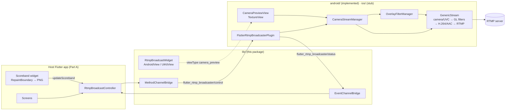

# Architecture — Overview

`flutter_rtmp_broadcaster` is **Part B** of a two-part system:

- **Part A** (host app, not this repo): UI, scoreband widget rendering, score data feeds.
- **Part B** (this package): camera ownership, native frame compositing, encoding, RTMP push.

## Core rules
1. **Camera ownership** — the package owns the camera 100%. The host app must not use the `camera` package.
2. **One camera session end-to-end** — preview is an output of the encoder pipeline, not a second session.
3. **Push model, no polling** — no `Timer.periodic` in the package; the app pushes scoreband PNGs on change.
4. **Sponsors static** — sent in `configure`, cached natively.
5. **One widget** — `RtmpBroadcastWidget` is a transparent preview; all compositing is native.
6. **URL assembly** — app passes `rtmpUrl` + `rtmpKey`; Dart sends `rtmpEndpoint = "$rtmpUrl/$rtmpKey"`.

## Where things live

| Concern | Dart | Android | iOS |
|---|---|---|---|
| Public API | `lib/src/rtmp_broadcast_controller.dart` | — | — |
| Channels | `lib/src/channels/` | `FlutterRtmpBroadcasterPlugin.kt` | `FlutterRtmpBroadcasterPlugin.swift` (stub) |
| Preview | `rtmp_broadcast_widget.dart` | `camera/CameraPreviewFactory.kt`, `CameraPreviewView.kt` | planned |
| Pipeline | — | `camera/CameraStreamManager.kt` | planned `camera/CameraStreamManager.swift` |
| Overlays | `models/sponsor_*.dart` | `overlay/OverlayFilterManager.kt`, `SponsorConfig.kt` | planned `overlay/OverlayCompositor.swift` |
| RTMP events | `models/rtmp_status.dart` | `rtmp/RtmpConnectChecker.kt` | planned |
| USB | `models/usb_device_info.dart` | `usb/` | n/a |
| Diagnostics | — | `diag/DiagLogger.kt` | n/a |

Details: [android.md](android.md) · [ios.md](ios.md) · contracts in [../specs/](../specs/).

## Defaults
- Default config `youtube720Portrait`: 720×1280 @ 30 fps, 2.5 Mbps H.264, 2 s keyframe.
- Audio: AAC 128 kbps, 44.1 kHz stereo.
- Reconnect: 3 attempts × 3 s.
