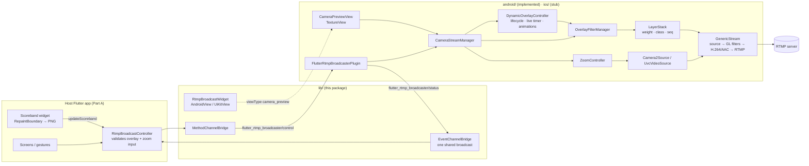

# Architecture — Overview

`flutter_rtmp_broadcaster` is **Part B** of a two-part system:

- **Part A** (host app, not this repo): UI, gestures (e.g. pinch zoom), scoreband widget rendering, score data feeds, overlay content.
- **Part B** (this package): camera ownership (including zoom), native frame compositing, encoding, RTMP push.

## Core rules
1. **Camera ownership** — the package owns the camera 100%. The host app must not use the `camera` package.
2. **One camera session end-to-end** — preview is an output of the encoder pipeline, not a second session.
3. **Push model, no polling** — no timers in Dart; the app pushes scoreband PNGs and overlay updates on change. Motion (durations, tickers, GIFs, carousels, animations) runs natively.
4. **Sponsors static** — sent in `configure`, cached natively.
5. **One widget** — `RtmpBroadcastWidget` is a transparent preview with no gestures; all compositing is native.
6. **One layer stack** — sponsors, scoreband and dynamic overlays are ordered by weight 0–100 in `LayerStack` ([ADR 0014](../decisions/0014-layer-stack-weights.md)).
7. **Zoom in the source** — Camera2 / UVC zoom before GL, so overlays are never zoomed ([ADR 0017](../decisions/0017-source-native-zoom.md)).
8. **URL assembly** — app passes `rtmpUrl` + `rtmpKey`; Dart sends `rtmpEndpoint = "$rtmpUrl/$rtmpKey"`.

## Where things live

| Concern | Dart | Android | iOS |
|---|---|---|---|
| Public API | `lib/src/rtmp_broadcast_controller.dart` | — | — |
| Channels | `lib/src/channels/` | `FlutterRtmpBroadcasterPlugin.kt` | `FlutterRtmpBroadcasterPlugin.swift` (stub) |
| Preview | `rtmp_broadcast_widget.dart` | `camera/CameraPreviewFactory.kt`, `CameraPreviewView.kt` | planned |
| Pipeline | — | `camera/CameraStreamManager.kt` | planned `camera/CameraStreamManager.swift` |
| Sponsors + scoreband | `models/sponsor_*.dart` | `overlay/OverlayFilterManager.kt`, `SponsorConfig.kt`, `OverlayGeometry.kt` | planned `overlay/OverlayCompositor.swift` |
| Layer order | — | `overlay/LayerStack.kt`, `GlFilterSink.kt` | planned |
| Dynamic overlays + carousel | `models/dynamic_overlay.dart` | `overlay/DynamicOverlayController.kt`, `DynamicOverlayModels.kt`, `OverlayContentDecoder.kt`, `OverlayVisuals.kt`, `LayerRenderer.kt`, `DynamicLayerFilter.kt`, `ChoreographerFrameDriver.kt` | parity backlog |
| Camera zoom | `models/zoom_info.dart` | `camera/ZoomController.kt`, `ZoomTargets.kt`, `usb/ZoomableUvcCamera.kt` | parity backlog |
| RTMP events | `models/rtmp_status.dart` | `rtmp/RtmpConnectChecker.kt` | planned |
| USB | `models/usb_device_info.dart` | `usb/` | n/a |
| Diagnostics | — | `diag/DiagLogger.kt` | n/a |

Details: [android.md](android.md) · [ios.md](ios.md) · contracts in [../specs/](../specs/).

## Defaults
- Default config `youtube720Portrait`: 720×1280 @ 30 fps, 4 Mbps H.264, 2 s keyframe (1080p presets: 10 Mbps; [ADR 0019](../decisions/0019-youtube-preset-bitrates.md)).
- Audio: AAC 128 kbps, 44.1 kHz stereo.
- Reconnect: 3 attempts × 3 s.
- Dynamic overlays: 16 max; weights sponsor 10, scoreband 50, dynamic 50.
